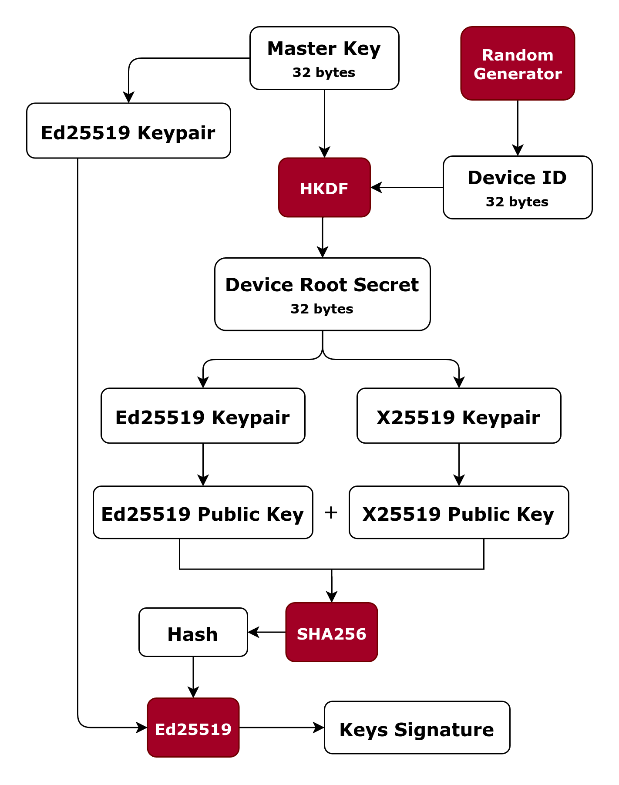

# RFC 0003: New Device
Status: `Approved`

Author: Danylo Derkach

Created: 2026-01-09

Last Update: 2026-01-14
## 1. Summary
This RFC defines a deterministic device identity derivation mechanism based on the account Master Key. Each device obtains an independent cryptographic identity derived locally without relying on the server as a trusted party.

The proposed design enables secure multi device support while preserving cryptographic isolation between devices and allowing independent verification of device authenticity.

## 2. Definitions

| Definition           | Meaning                                                                                                |
| -------------------- | ------------------------------------------------------------------------------------------------------ |
| `Master Key`         | A high-entropy secret from which all cryptographic material of an account is deterministically derived |
| `Device ID`          | An unique public identifier of a device                                                                |
| `Device Root Secret` | A device high-entropy secret, deterministically derived from the Master Key                            |

## 3. Motivation

Modern usage of the system requires the same account to be accessed from multiple independent devices. Each device must be able to operate securely without transferring private keys or trusting the server.

The system is based on a single Master Key as the cryptographic root of trust. Introducing additional devices therefore requires a deterministic and verifiable mechanism to derive device-specific cryptographic identities from the Master Key.

This RFC defines a device identity derivation scheme that:
- preserves the zero-trust model,
- avoids sharing private key material between devices,
- allows independent verification of device authenticity,
- maintains long-term compatibility and deterministic behavior.
## 4. Goals & Non-Goals
**Goals:**
- Deterministic device identity derivation from the Master Key
- Ability to verify the authenticity of a device
- Long-term compatibility

**Non-Goals:**
- Authentication protocol
- Data packet framing
## 5. Requirements
- The device identity **MUST** be derived from the Master Key
- From the same Master Key and context **MUST** be derived the same device identity
- Each device **MUST** have their own cryptographic identity
- It **MUST** be possible to verify authenticity of a device identity
- Device ID **MUST** be unique and randomly generated
## 6. Proposed Design
This design introduces a deterministic device identity derived from the Master Key. Each device obtains an independent cryptographic identity without sharing private keys or relying on the server as a trusted party.

The Master Key is the sole root of trust in the system. All cryptographic operations related to device identity derivation are strictly local and performed on the client device. The server is considered untrusted and is not involved in identity derivation.

Device identity is deterministically derived from the Master Key and a Device ID. This ensures:
- uniqueness of device identities,
- cryptographic separation between devices,
- reproducibility on re-import.

Each device identity consists of:
- a device ID,
- a signing key pair,
- an encryption key pair,
- a signature of public keys
- a public representation verifiable by other peers.

The identity derivation flow is illustrated in the following diagram:

The diagram shows how the Master Key is used as the root input, from which device specific keys are derived in a one-way and deterministic manner.

This design provides the following security properties:
- private keys never leave the device,
- compromise of one device does not affect others,
- server-side attacks cannot forge device identities,
- device authenticity can be independently verified.

## 7. Module Responsibilities

- core/
  - provides device derivation API
  - perform business logic
  - finalizes device derivation
- crypto/
  - cryptographic identity derivation
  - provides HKDF implementation
  - provides hash implementation
  - provides Ed25519 implementation
  - does not perform business logic
- shared/
  - error handling
## 8. Security Considerations
The Master Key is the single root of trust. No external party, including the server, is required to be trusted. The server is considered an untrusted component.

If the server is compromised:
- An attacker cannot derive device private keys or the Master Key.
- An attacker cannot forge a valid device identity.
- An attacker cannot decrypt end-to-end encrypted data.
- An attacker cannot silently replace device identities without detection.

All private cryptographic material remains strictly on client devices. Public data obtained from the server can be independently verified using cryptographic proofs.

Which attacks ARE mitigated:
- Server database compromise
- Key substitution attacks
- MITM attacks during device identity exchange
- Forged device identities
- Cross-device key reuse

Which attacks ARE NOT mitigated:
- Master Key theft
- Full device compromise
- Social engineering attacks

## 9. Impact on Existing Architecture

This RFC does not change module boundaries, introduce new dependencies or break compatibility.
## 10. References

- [RFC 0001 Account Creation](RFC-0001-account-creation.md)